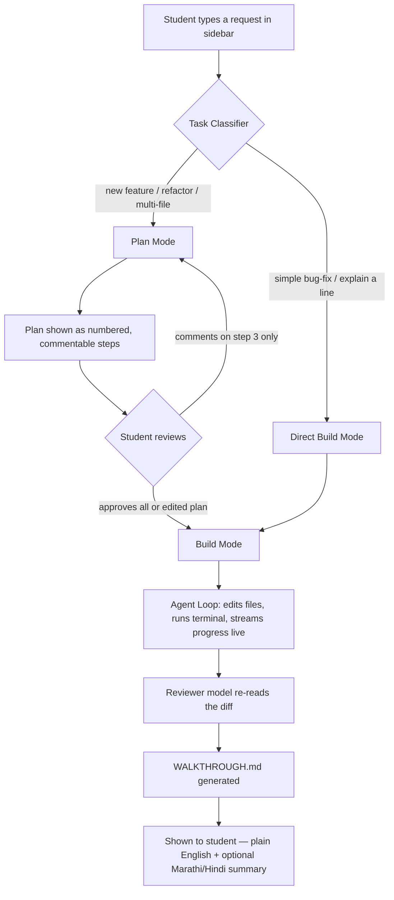
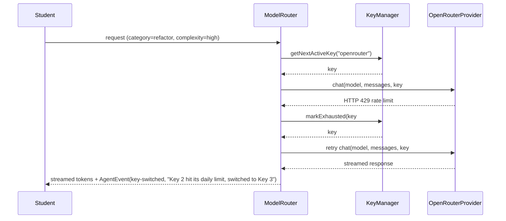
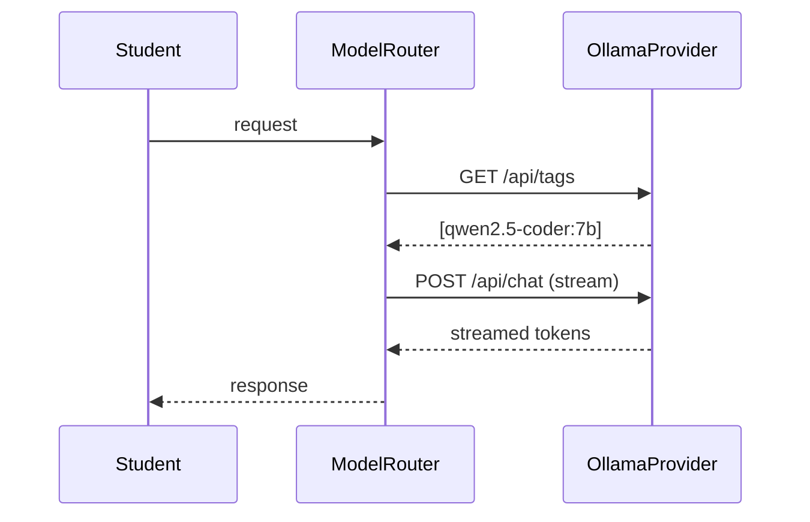
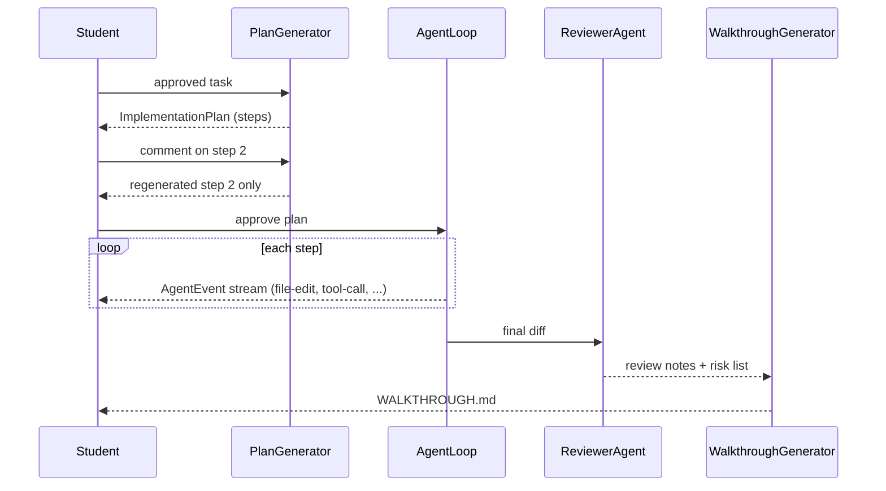

# Code Bhau Agent — System Architecture

**Version:** 3.0 (Agent Rewrite)
**Status:** Design spec — not yet built
**Companion documents:** `IMPLEMENTATION_PLAN.md` (phase-by-phase build tasks), `AGENT.md` (engineering standards for coding agents working in this repo)

---

## 0. How to use this document

This document has two audiences and is written for both on purpose:

- **Part A — Product Walkthrough** is for humans (Yash, Aryan, future contributors). Plain language, diagrams, no code.
- **Part B — System Specification** is for the coding agent (GLM-5.2) building this. It is dense on purpose: directory layout, interfaces, data flows, call chains, and hard constraints. GLM-5.2 retains architectural context well across a long session, so **paste this entire file as context before giving it any phase task** from `IMPLEMENTATION_PLAN.md` — context first, instruction after.

If you (Yash) are reviewing GLM-5.2's output, Part A is enough to sanity-check *intent*. Use Part B when you need to check whether GLM actually followed the contract.

---

# PART A — Product Walkthrough (Human-Readable)

### What we're building

Code Bhau today is a small, fully offline VS Code extension: it recognizes ~10 common error types and explains them in funny, culturally-Marathi language. It has no AI model calls at all.

Code Bhau Agent (v3) is a new layer on top: a coding agent — similar in spirit to Continue, Cursor, or Claude Code — that a beginner can actually afford and understand. It writes code, not just explains errors. The whole point is removing two specific fears beginners have:

1. **"I'll run out of credits and get stuck mid-project."** → Solved by letting students plug in their own free/cheap API keys from multiple providers, with automatic failover between their own keys, plus a fully offline local-model mode with zero cost.
2. **"I don't know which AI model to use for which task."** → Solved by a task classifier that picks the right model tier automatically, so the student never has to make that decision.

The Code Bhau personality (Marathi humor, "bhau/मित्रा" tone, chai-shop references) is preserved and extended — the agent's final output for every build is a `WALKTHROUGH.md` written partly in that same voice.

### The two operating modes

```mermaid
flowchart LR
    subgraph Local Mode
        A1[Ollama] 
        A2[LM Studio]
    end
    subgraph Cloud Mode - BYOK
        B1[OpenRouter - student's own key]
        B2[NVIDIA NIM - student's own key]
        B3[Other OpenAI-compatible provider]
    end
    U[Student] --> Switch{Mode toggle in settings}
    Switch -->|Local, free, private, slower| Local Mode
    Switch -->|Cloud, faster, needs a key| Cloud Mode - BYOK
```

**Important design decision:** Cloud mode is strictly "Bring Your Own Key" (BYOK). Code Bhau never pools or ships its own provider accounts to route around rate limits — that risks getting every user's access banned at once if a provider flags the pattern, and it's against most providers' terms of service. Instead, a student can register **up to 10 of their own keys** (their free OpenRouter key, a friend's key they were given permission to use, a NVIDIA NIM trial key, etc.), and Code Bhau fails over between *those* automatically. Same "never get stuck" experience, none of the shared-account risk.

### The request lifecycle



This mirrors Google Antigravity's plan-then-build pattern: nothing gets written to disk until the student has seen and can push back on the plan, but trivial fixes can skip straight to Build Mode so the tool doesn't feel bureaucratic for small asks.

### Why fork Continue instead of building from zero

Continue (`continuedev/continue`, Apache-2.0) already has a working, tested agent loop: tool-calling, file diffing/applying, terminal execution, streaming, and a provider abstraction. Apache-2.0 permits forking and rebranding commercially as long as attribution and the license are kept intact. Reusing this core is what makes "superfast shipping with quality output" realistic — the new work is the task classifier, the mode router, the BYOK key manager, the plan-commenting UI, and the reviewer/walkthrough step, not the agent loop itself.

---

# PART B — System Specification (Build Spec for GLM-5.2)

## B.1 Repository layout

```
code-bhau-agent/
├── AGENT.md
├── ARCHITECTURE.md
├── IMPLEMENTATION_PLAN.md
├── package.json                        # npm workspaces root
├── core/                                # forked + trimmed from continuedev/continue "core"
│   ├── providers/
│   │   ├── local/
│   │   │   ├── OllamaProvider.ts
│   │   │   └── LMStudioProvider.ts
│   │   ├── cloud/
│   │   │   ├── OpenRouterProvider.ts
│   │   │   └── NvidiaNimProvider.ts
│   │   └── ProviderRegistry.ts
│   ├── keys/
│   │   ├── KeyVault.ts                  # wraps VS Code SecretStorage
│   │   └── KeyManager.ts                # quota tracking + failover across a user's own keys
│   ├── classifier/
│   │   └── TaskClassifier.ts
│   ├── router/
│   │   ├── ModeRouter.ts                # plan-then-build vs direct-build vs chat-only
│   │   └── ModelRouter.ts               # task -> model tier -> provider+model
│   ├── planning/
│   │   ├── PlanGenerator.ts
│   │   └── PlanStore.ts
│   ├── agent/
│   │   ├── AgentLoop.ts                 # forked from Continue core agent loop
│   │   ├── tools/
│   │   │   ├── FileEditTool.ts
│   │   │   ├── TerminalTool.ts
│   │   │   └── CodebaseSearchTool.ts
│   │   └── DiffApplier.ts
│   ├── review/
│   │   ├── ReviewerAgent.ts
│   │   └── WalkthroughGenerator.ts
│   ├── legacy-classifier/               # v1 Code Bhau, reused as the fast "explain this error" path
│   │   ├── ErrorClassifier.ts
│   │   ├── ResponseSelector.ts
│   │   └── errors.json
│   └── types/
│       ├── provider.ts
│       ├── task.ts
│       ├── plan.ts
│       ├── agentEvent.ts
│       └── walkthrough.ts
├── extensions/
│   └── vscode/
│       ├── src/
│       │   ├── extension.ts
│       │   ├── SidebarProvider.ts
│       │   └── HoverProvider.ts          # reused from v1
│       └── package.json
└── gui/                                  # sidebar webview UI, forked from Continue's gui
    ├── src/
    │   ├── components/
    │   │   ├── PlanView.tsx
    │   │   ├── BuildProgressView.tsx
    │   │   ├── KeyManagerSettings.tsx
    │   │   └── WalkthroughView.tsx
    │   └── App.tsx
    └── package.json
```

**Rule:** nothing outside `core/legacy-classifier/` may be deleted — the existing v1 files (`ErrorClassifier.ts`, `ResponseSelector.ts`, `errors.json`) move into that folder unmodified in Phase 0 and get wired in, not rewritten, in Phase 6.

## B.2 Core module responsibilities

| Module | Responsibility | Must NOT do |
|---|---|---|
| `TaskClassifier` | Given a raw student request + open-file context, produce a `TaskClassification` | Call any model provider directly for anything other than classification |
| `ModeRouter` | Decide plan-then-build vs direct-build vs chat-only from the classification | Generate plan content itself |
| `ModelRouter` | Map `TaskClassification` → concrete `{providerId, modelId}` using the task→model preference table | Hold API keys or make HTTP calls itself |
| `KeyManager` | Track quota/usage per registered key, decide next-available key on failure | Store secrets in plaintext, ever log key values |
| `KeyVault` | Thin wrapper around VS Code `SecretStorage` | Be readable outside the extension host process |
| `ProviderRegistry` | Holds all `ModelProvider` implementations, exposes a uniform `chat()` | Contain provider-specific business logic outside its own provider file |
| `PlanGenerator` | Turns an approved task into an `ImplementationPlan` (steps) | Execute any file edits |
| `AgentLoop` | Executes an approved plan step-by-step, calling tools, streaming `AgentEvent`s | Skip the plan and improvise scope beyond what was approved |
| `ReviewerAgent` | Re-reads the final diff with a **different (smaller/cheaper) model** than the one that wrote it | Reuse the same model instance/context as the writer, to avoid shared blind spots |
| `WalkthroughGenerator` | Produces `WALKTHROUGH.md` from the diff + review notes | Invent claims about testing that wasn't actually run |

## B.3 Key API contracts (TypeScript)

```typescript
// core/types/provider.ts
export type ProviderKind = "local" | "cloud";

export interface ModelInfo {
  id: string;
  contextWindow: number;
  supportsTools: boolean;
  costPerMTokIn?: number;   // undefined for local models
  costPerMTokOut?: number;
}

export interface ChatMessage {
  role: "system" | "user" | "assistant" | "tool";
  content: string;
  toolCallId?: string;
}

export interface ToolDefinition {
  name: string;
  description: string;
  parameters: Record<string, unknown>; // JSON schema
}

export interface ChatRequest {
  model: string;
  messages: ChatMessage[];
  tools?: ToolDefinition[];
  stream: true;
}

export type ChatChunk =
  | { type: "text"; delta: string }
  | { type: "tool_call"; name: string; args: unknown; id: string }
  | { type: "done"; finishReason: string };

export interface ModelProvider {
  id: string;                 // "ollama" | "lmstudio" | "openrouter" | "nvidia-nim"
  kind: ProviderKind;
  displayName: string;
  listModels(): Promise<ModelInfo[]>;
  chat(request: ChatRequest, apiKey?: string): AsyncIterable<ChatChunk>;
}
```

```typescript
// core/types/task.ts
export type TaskCategory = "bug-fix" | "new-feature" | "refactor" | "explain" | "question";
export type ModelTier = "fast-small" | "balanced" | "deep-reasoning";

export interface TaskClassification {
  category: TaskCategory;
  complexity: "low" | "medium" | "high";
  suggestedMode: "plan-then-build" | "direct-build" | "chat-only";
  suggestedModelTier: ModelTier;
  rationale: string; // short, shown to the student on hover — builds trust in the auto-routing
}
```

```typescript
// core/types/plan.ts
export interface PlanStep {
  id: string;
  order: number;
  title: string;
  description: string;
  filesTouched: string[];
  status: "proposed" | "commented" | "approved" | "rejected" | "regenerating";
  userComment?: string;
}

export interface ImplementationPlan {
  id: string;
  taskId: string;
  steps: PlanStep[];
  overallApprovalStatus: "draft" | "partially-approved" | "approved";
}
```

```typescript
// core/types/agentEvent.ts
export type AgentEvent =
  | { type: "step-started"; stepId: string }
  | { type: "tool-call"; tool: string; args: unknown }
  | { type: "file-edit"; path: string; diffSummary: string }
  | { type: "step-completed"; stepId: string }
  | { type: "key-switched"; fromKeyLabel: string; toKeyLabel: string; reason: string }
  | { type: "error"; message: string; recoverable: boolean };
```

```typescript
// core/types/walkthrough.ts
export interface WalkthroughDoc {
  summaryEnglish: string;
  summaryMarathi?: string;
  summaryHindi?: string;
  filesChanged: { path: string; changeType: "added" | "modified" | "deleted"; reason: string }[];
  howToTest: string[];
  risksFound: string[];
  reviewedByModel: string; // which model did the review pass, for transparency
}
```

```typescript
// core/keys/KeyManager.ts (interface only)
export interface ApiKeyRecord {
  id: string;
  providerId: string;
  label: string;            // user-given nickname, e.g. "My personal OpenRouter key"
  secretRef: string;        // reference into KeyVault, never the raw key
  dailyQuotaTokens?: number;
  usedTodayTokens: number;
  lastResetDate: string;    // ISO date
  status: "active" | "exhausted" | "invalid";
}

export interface KeyManager {
  registerKey(providerId: string, label: string, rawKey: string): Promise<ApiKeyRecord>;
  getNextActiveKey(providerId: string): Promise<ApiKeyRecord | null>;
  markExhausted(keyId: string): Promise<void>;
  markInvalid(keyId: string): Promise<void>;
  recordUsage(keyId: string, tokensUsed: number): Promise<void>;
}
```

## B.4 Major data flows

### Flow 1 — Model routing with key failover (Cloud mode)



### Flow 2 — Local mode



If `listModels()` returns empty, the UI must offer a one-click "pull `qwen2.5-coder:7b`" action rather than a bare error — this is a beginner-facing product, not a devtool.

### Flow 3 — Plan → Build → Review → Walkthrough



## B.5 Engineering constraints (hard rules — do not violate)

1. **No provider ever receives a raw API key from anywhere except `KeyVault` at call time.** Keys are never logged, never included in `AgentEvent`s, never written to any `.md` output file, never sent to a different provider than the one they belong to.
2. **`KeyManager` only ever rotates across keys a single user registered themselves.** No pooling of keys across users, no bundled/shared provider accounts. This is a hard product boundary, not just a coding style preference — see `ARCHITECTURE.md` Part A for why.
3. **`AgentLoop` may only touch files listed in the approved plan's `filesTouched`.** If it needs to touch an additional file mid-execution, it must emit an `error` event requesting re-approval, not silently expand scope.
4. **`ReviewerAgent` must use a different model than whichever model wrote the code** (smaller/cheaper by default), to avoid the writer reviewing its own blind spots.
5. **`WalkthroughGenerator` may only claim tests were run if a tool result actually shows them running.** No fabricated "all tests pass" claims.
6. Do not introduce new runtime dependencies without flagging them explicitly in the phase's output summary for human review.
7. Do not modify the public shape of any interface in `core/types/` without updating this document in the same change.
8. Do not commit changes automatically. Every phase ends with a diff for human review, never an auto-commit.

## B.6 Non-functional requirements

- **Privacy-by-default:** no telemetry, no usage data leaves the machine, beyond the model calls the student explicitly configured. State this plainly in the README — it matters to the trust story for students worried about data going to unfamiliar providers.
- **Offline-first fallback:** if no cloud key is configured and no local runtime is detected, the extension must still function using the existing v1 error-explanation feature (`legacy-classifier`) rather than becoming useless.
- **Streaming everywhere:** no UI surface should block on a full response; `AgentEvent` and `ChatChunk` are both streams by design.
- **Low-resource awareness:** default local-model recommendations should target 3B–8B parameter models (e.g., Qwen2.5-Coder 7B, Llama 3.2 3B) given typical student laptop RAM, not 30B+ models.

## B.7 Known tech debt to design around (carried over from v1 audit)

- The v1 `ErrorClassifier` had two now-fixed bugs (synthetic string format mismatch on TS diagnostic codes; pattern-ordering issue where `null_reference` swallowed `array_out_of_bounds`/`promise_rejection` matches). When wiring `legacy-classifier` into the new `TaskClassifier`'s "explain" fast-path in Phase 6, do not reintroduce catch-all-before-specific pattern ordering.
- The Marathi/Hindi humor dataset is ~10% complete (10 of a 100-entry target, JavaScript/Node.js only). `WalkthroughGenerator`'s Marathi/Hindi summaries should draw on this dataset's tone but must not block on the dataset being complete — treat it as an enhancement layer, not a dependency.

## B.8 Glossary

- **BYOK** — Bring Your Own Key. The student supplies their own provider API keys; Code Bhau never supplies or pools its own.
- **Plan Mode** — the agent proposes a numbered plan before touching any file; the student can comment on individual steps.
- **Build Mode** — the agent executes an approved plan (or a trivial task directly), streaming progress.
- **Reviewer pass** — a second, independent model check on the finished diff before it's shown as complete.
- **Walkthrough** — the human-readable `WALKTHROUGH.md` summary generated after every build.
